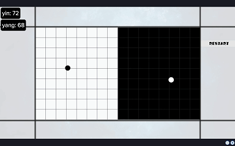
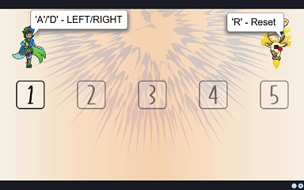

# Scoolcode Platform Projects

### While I was a Logiscool Trainer, I've worked on some personal projects that helped me understand and better teach on the Scoolcode platform. 

*Note that I've saved the files as .js files but the actual programming language for the Scoolcode platform is StageScript*

***
## Table of Contents

 1. [Ying Yang Wars](#Ying-Yang-Wars)
 2. [Smart Cube](#smart-cube)
 3. [End For Wisagi](#end-for-wisagi)

***

## Ying Yang Wars

You can find the game [here](https://play.scoolcode.com/65ef64977d04975a9f54f5b2?).

The game is inspired by the internet famous [pong wars](https://github.com/vnglst/pong-wars).
***
## Smart Cube

You can find the game [here](https://play.scoolcode.com/65fc87e3aca38318d2c91d63?).

Smart Cube is inspired by [1-Square](https://www.coolmathgames.com/0-1-square), a puzzle game made by Armor Games, and is available on Coolmath Games and other gaming platforms.

1-Square was given as the contest theme for a Unity Development Intership, where I was selected with my original project that can be found [here](https://github.com/dragos-pk3/smartcube-unity).

This project was my first game ever made with Unity and I took the time to write a version for the Scoolcode Platform. 

***
## End For Wisagi

### About the Title: **End For Wisagi**

The title **End for Wisagi** is a playful nod to the **four core stats** of the game that enhances player experience by giving meaninful choice elements.

- **Endurance** (End) - Increases `Health` and `Damage Resistance`
- **Force** (For) - Strengthens `Weapon Damage` and `Knockback`
- **Wisdom** (Wis) - Expands `Mana Pool` and reduces `Skill Cooldowns`
- **Agility** (Agi) - Boost `Movement Speed`, `I-Frames` and `Recovery Rate`

Together, they form the playful phrase “End For Wisagi”, making an emphasis on the game's combat and progression system.

---

### Multiple Playable Classes
- **Ninja**  
  *Fast-moving, bomb-dashing hero.*  
  - `C` for Bomb Dash  
  - `Q` for Five Star Ninja (summons rotating weapons)  
  - `R` for Ninja Discipline (enhanced speed & i-frames)  

- **Wizard**  
  *Scholarly caster specializing in AoE and teleportation.*  
  - `C` for Teleportation  
  - `Q` for Magic Zap (ranged cast)  
  - `R` for Summon Golem  

- **Warrior**  
  *Heavy-hitting tank with special unlock requirement.*  
  - `C` for Spinach (temporary damage buff)  
  - `Q` for Akimbodat (dual weapon madness)  
  - `R` for Hammer Drop  

### Stats & Leveling
- **Four core attributes**: Endurance, Force, Wisdom, Agility  
- Earn experience to increase your level, unlocking +1 stat point per level  
- Boost your health, damage, mana, and speed as you see fit  
- Level cap is set to 20

### Combat & Abilities
- **Movement**: `W`, `A`, `S`, `D`  
- **Spells**: `C`, `Q`, `R` (mana-costly, each has cooldown)  
- **Melee Attacks**: Wield a variety of animated weapons around your character  
- **Mana & Health Bars**: Real-time updates of resources  
- **Pickups**: Random health items appear throughout stages

### UI & Controls
- **Stat Buttons**: Spend your points by clicking the on-screen icons (or pressing keys `1`, `2`, `3`, `4`)  
- **Hover Effects**: Mouse over UI to see tooltips  
- **Cooldown Indicators**: Spells gray out and shake while on cooldown  
- **Game Over** and **Victory** sequences with final timers, special password reveal for unlocking Warrior

### Boss Battle
 The Sabretooth is using a finite state machine, it will engage upon the player when he's too close to it.
 
 ## How to Play
1. **Select Class**: Click on a class portrait to start. (Warrior requires a password).
2. **Move**: Use `W`, `A`, `S`, `D` to move around.
3. **Attack & Spells**:
   - **Regular Attacks** are automatic when enemies are near (weapon hits).
   - **Use** `C`, `Q`, `R` (when off cooldown) to activate class abilities.  
4. **Level Up**: Gain experience by defeating waves of enemies, then spend stat points.
5. **Survive Waves**: Defeat each wave before moving on to the next. Keep going until you face the **Sabretooth** boss!
6. **Boss Fight**: Use the **Bell** with `E` at the correct time to disrupt the boss if it’s off cooldown.

 *The final boss battle is heavily inspired by **Spiral Knights** [Snarbolax](https://wiki.spiralknights.com/Snarbolax).* 

You can find the game [here](https://play.scoolcode.com/65f016776bd2cb4fbac5a564?).

***

